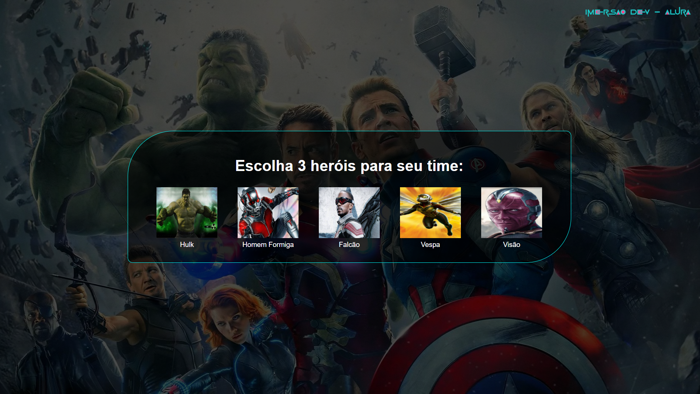

# 🦸♂️🦹♀️ Marvel: Heroes vs. Villains 🦹♂️🦸♀️

**Bem-vindo ao "Marvel: Heroes vs. Villains Showdown"!**  
Um projeto interativo onde você monta um time de **heróis da Marvel** e enfrenta um time de **vilões icônicos** controlado pela máquina.  
O objetivo é simples: **escolher 3 heróis** entre 5 opções aleatórias (dentre 15 disponíveis) e desafiar a máquina, que escolherá **3 vilões** de um total de 13.  
Vence quem tiver a **maior força total** ao somar os atributos de cada equipe!

---
## 📸 Captura de Tela

---

## ✨ Funcionalidades

- **Heróis e Vilões da Marvel**: Personagens autênticos do universo Marvel.
- **Seleção Aleatória de Heróis**: A cada atualização, 5 heróis são sorteados (de 15 disponíveis).
- **Escolha Estratégica**: Selecione 3 heróis para formar seu time.
- **Desafio da Máquina**: A máquina escolhe 3 vilões automaticamente (de 13 opções).
- **Batalha Épica**: Comparação de força total entre os times.
- **Resultado Instantâneo**: Descubra se os heróis ou vilões venceram!

---

## 🛠️ Tecnologias Utilizadas

🖥️ Tecnologias

  
  
  

---

## 🚀 Link
[Venha Jogar!](https://henriluiz.github.io/cabo_de_guerra/ "Combate Épica Marvel!")

---

## ⚠️ Aviso Legal

Este projeto é não oficial e foi criado para fins educacionais. Todos os personagens são propriedade da Marvel Entertainment.

---

Feito com ❤️ por [Luiz Azevedo](https://github.com/Henriluiz).
